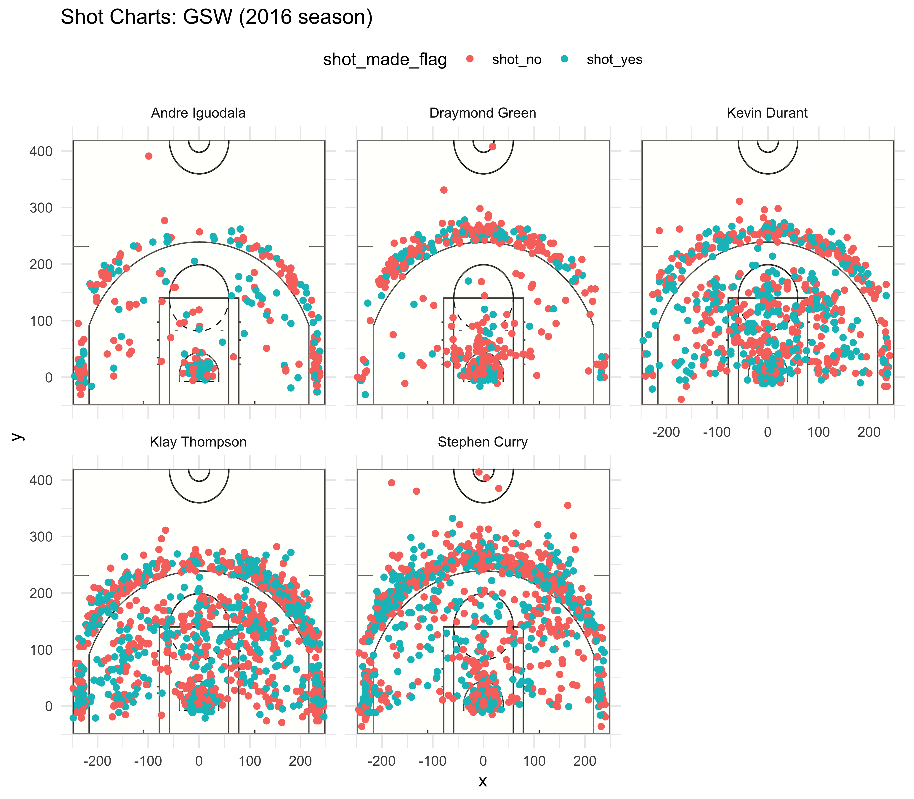

Workout01 Report
================
Jingjing Jia
3/4/2019

### How effective are their shots? -- Golden States Warriors' shooting analysis

#### Introduction

Golden State Warriors (GSW), the team winning the 2016-2017 NBA championship, has always been a team attracting lots of attention. GSW posted notable achievements by setting several NBA records during that season. This article is intended to show and analyze shooting data of the five players of Warriors during the 2016-2017 regular season to find out what each player specializes in and how effective their shots are.

#### Background & Motivation

Golden State Warriors is an American professional basketball team founded in 1946 and now based in Oakland, California. As of the 2016-2017 season, the team is lined up with five players: Klay Thompson, Stephen Curry, Kevin Durant, Andre Iguodala and Draymond Green. With Stephen Curry setting the new NBA record for most 3-pointers in a game (McCauley, 2016), Klay Thompson being the first player to score 60 points or more in less than 30 minutes (Mather, 2016) and Draymond Green being the first player to post a triple-double with fewer than 10 points during the 2016-2017 regular season (Nba.com Staff, 2017), Warriors have again made history. Four of the players, Thompson, Curry, Durant and Green were named to 2017 NBA All-Stars Game, making GSW the eighth team in history to achieve so (Steward, 2017).

We are interested in breaking down GSW's notable performance. What made this team great? How much was each player contributing? Was there an outstanding player? Did the players show potential of setting their new records? ... We will investigate such questions by looking into the shooting data of the players.

#### Data

We firstly present shot charts of each player with respect to relative positions in court.



The above graph contains five subgraphs, one for each player with the name on top. Each subgraph used a court image as background to show the shooting position better. The dots are where the players made their shots. A red dot means the shot was not made and a blue dot means the shot was successfully made.

We then show effective shooting percentage data in decreasing order as follows:

``` r
# 2 point effective shooting % by player
pt2eff <- arrange(summarise(filter(group_by(alldf, name), shot_type=="2PT Field Goal"), total=length(shot_type), made=length(shot_made_flag[shot_made_flag == "shot_yes"]), perc_made=made/total*100), desc(perc_made))

pt2eff
```

    ## # A tibble: 5 x 4
    ##   name           total  made perc_made
    ##   <chr>          <int> <int>     <dbl>
    ## 1 Andre Iguodala   210   134      63.8
    ## 2 Kevin Durant     643   390      60.7
    ## 3 Stephen Curry    563   304      54.0
    ## 4 Klay Thompson    640   329      51.4
    ## 5 Draymond Green   346   171      49.4

``` r
# 3 point effective shooting % by player
pt3eff <- arrange(summarise(filter(group_by(alldf, name), shot_type=="3PT Field Goal"), total=length(shot_type), made=length(shot_made_flag[shot_made_flag == "shot_yes"]), perc_made=made/total*100), desc(perc_made))

pt3eff
```

    ## # A tibble: 5 x 4
    ##   name           total  made perc_made
    ##   <chr>          <int> <int>     <dbl>
    ## 1 Klay Thompson    580   246      42.4
    ## 2 Stephen Curry    687   280      40.8
    ## 3 Kevin Durant     272   105      38.6
    ## 4 Andre Iguodala   161    58      36.0
    ## 5 Draymond Green   232    74      31.9

``` r
# effective shooting % by player
shoteff <- arrange(summarise(group_by(alldf, name), total=length(shot_type), made=length(shot_made_flag[shot_made_flag == "shot_yes"]), perc_made=made/total*100), desc(perc_made))

shoteff
```

    ## # A tibble: 5 x 4
    ##   name           total  made perc_made
    ##   <chr>          <int> <int>     <dbl>
    ## 1 Kevin Durant     915   495      54.1
    ## 2 Andre Iguodala   371   192      51.8
    ## 3 Klay Thompson   1220   575      47.1
    ## 4 Stephen Curry   1250   584      46.7
    ## 5 Draymond Green   578   245      42.4

#### Analysis

From the shot chart and the tables, we can see Curry and Thompson are the two players who made the most shooting attempts, both of them making more 3pt shots than 2pt shots.

Thompson made the second most 3pt shots and still managed to get the most effective 3pt shots out of the five players. 42.4% of his 3pt shots were successfully made. Thompson's 2pt shot effectiveness, on the other hand, is not as good comparatively, ranking the 4th out of the five players, but he was making the most attempts among the team. Overall, Thompson made a lot of shots. He was the player who made the most 2pt shots and the second most 3pt shots. With decent 3pt shooting effectiveness, it can be deducted Thompson added quite many points to the team. It was also hence not much a surprise he became the first player to achieve more than 60 points in less than 30 minutes.

Curry set the new NBA record for most 3 pointers in a game during this season. From the 2pt effective shooting % and 3pt effective shooting % table, we can see Curry focuses much more on 3pt shots than 2pt shots. Out of the 5 players, he made the most 3pt shots and ranked 2nd in terms of effective 3pt shooting. Curry had the potential of breaking the record for most 3 pointers judged from the number of attempts he made and his shooting effectiveness.

Durant made less shots than Thompson and Curry, but his contribution is non-negligible. Durant specialized in 2pt shots with a 60.7% 2pt shooting effectiveness. Though Durant had relatively low 3pt shooting effectiveness, he was the player who was made the most effective shooting overall with 54.1%.

Iguodala made significantly less shots than the three players mentioned above. Despite that, Iguodala was the most effective 2pt shooter with an effective percentage of 63.8%. On the other hand, he made the least 3pt shots and did not have a decent 3pt effective shooting percentage. For a defensive player, the stats is good enough.

Green was also a defensive player, who recorded ranked the least effective shooting for both 2pt and 3pt shots. Green was not focusing on shooting. “I’ve got to bring it on the defensive end,” said Green, “A lot of guys on this team can score. We don’t need me to score” (NBA.com Staff, 2017). He was the first NBA player with 10 steals and 5 blocks in a game since the 1970s (NBA.com Staff, 2017).

#### Conclusion

We can clearly see what makes GSW a great team, effective offensive players and defensive players who can also shoot. Shooting wise, Curry, Thompson and Durant much more shots than the others and scored a lot of points for the team. The contribution of Iguodala and Green cannot be directly shown from the data provided, but they provided support and defense without which the offensive players would not have chance to shoot.

#### Reference

Mather, Victor. “Klay Thompson Pours In 60 Points, in Just 29 Minutes.” The New York Times, 22 Dec. 2016, www.nytimes.com/2016/12/06/sports/basketball/klay-thompson-golden-state-warriors-60.html.

McCauly, Janie, and Associated Press. “Stephen Curry Hits NBA-Record 13 3-Pointers.” NBA.com, 8 Nov. 2016, www.nba.com/article/2016/11/08/curry-record-3-pointers.

NBA.com Staff. “Warriors' Draymond Green Records One-of-a-Kind Triple-Double with Rebounds, Assists and Steals.” NBA.com, 11 Feb. 2017, www.nba.com/article/2017/02/10/warriors-draymond-green-records-historic-triple-double.

Steward, Carl. “Four All-Stars?!? Warriors Join Rare NBA Company.” The Mercury News, 27 Jan. 2017, www.mercurynews.com/2017/01/26/four-all-stars-warriors-join-rare-nba-company/.
